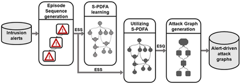
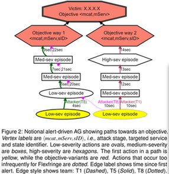
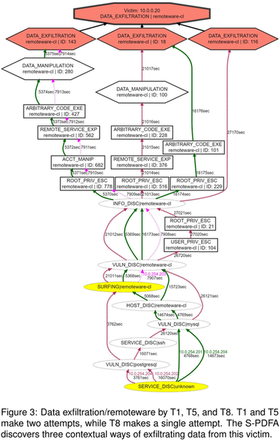

### SAGE: Intrusion Alert-driven Attack Graph Extractor

#### Motivation

- `Alert correlation techniques` - what attackers did (not how infrastructure was exploited)
- `AGs` - assessing paths and strategies used by cyber attackers when penetrating a network (have been widely used for visual analytics and network hardening)
- Existing methods to generate AGs: published system vulnerabilities report (vulnerability scanning) + prior expert knowledge => expensive and inefficient!

#### SAGE

- An unsupervised sequence learning system that automatically generates succinct high-severity AGs based on intrusion alerts without the need of expert knowledge and prior vulnerabilities
- Uses sequence learning to find patterns from intrusion alerts
- Models these intrusion alerts using an automaton
- Represents them as an AG
- Agnostic to host and network properties

#### S-PDFA

- Accentuates infrequent severe alerts without discarding low-severity alerts
- Summarizes attack paths leading to severe attack stages
- Captures the probabilistic and temporal dependence between alerts
- Alerts with identical signatures and different contexts (e.g. scanning at the start vs scanning midway through the attack)
- More expressive than Markov chains: modeling of context + easier interpretability

#### Attack Graphs

- **Vertex**: a group of alerts generated by an attacker action
- **Edge**: captures the temporal relationship between actions, showing attack progression

#### Building AGs

##### Step 1. Arrange intrusion alerts in sequences that characterise an attacker strategy

- `Alert = (attacker IP, victim IP, tServ, mcat)` (mcat being attack stage)
- Raw alerts are noisy and have duplicates => cleaning + aggregation
- `Hyper-alert` or `attack episode` - aggregation of alerts into groups that are likely to belong to the same attacker action (e.g. alerts that appear in bursts)
- `Episode` for an attack stage mcat: `(st, et, mcat, mServ)`
- Time-sorted `episode sequences (ES)` for each *(attacker, victim)* combination
- `Episode sub-sequences (ESS)` - ES is partitioned when a low-severity (LS) episode follows a high-severity (HS) episode (indicating the beginning of an attack attempt)

##### Step 2. S-PDFA

- Predicts the past, not the future
- HS mcat's are at the end of ESS -> which episodes eventually lead to HS attack stages
- `Flexfringe` automaton learning framework uses univariate `symbol` sequences: `(mcat, mServ)`
- Attack paths are summarized and clustered based on behavioural similarity
- **States**: milestones achieved by attackers (contextual meaning to the episodes' attack stages)
- `State sequence (ESQ)`: each ESS is replayed through the S-PDFA and is augmented with state identifiers (`sID`)
- ESQs -> AG (using Graphviz), per objective (obj), per victim (vic)

##### Step 3. Attack Graphs

- A compressed representation of intrusion alerts related to *(vic, obj)*
- `obj` = `(mcat, mServ, sID)` (mcat is one of the HS attack stages (specify end-goals)
- AG with root `(vic, obj)` = only the ESQ concerning *vic* and containing episode with *obj*
- *obj* achieved multiple times in an ESQ => each attempt is an individual path in the graph
- Different *sID*'s for the same *(mcat, mServ)* => different contextual means of obtaining the *obj* (each appears as a sub-objective in the graph)
- All attackers having achieved *obj* are shown in one graph (strategy comparisons)

#### Experimental setup

##### Dataset

- Open-source CPTC-2018 (Collegiate Penetration Testing Competition) dataset: different student teams were tasked to compromise a fictitious network (automotive company)
- Only attackers' IP information was available regarding the attacker strategies and attack progression
- Six teams, 330,270 alerts, 9 hours

##### Parameters of SAGE

1. `t` (=1.0sec) - to discard repeated alerts
2. `w` (=150sec) - window length to aggregate alert episodes
3. `symbol_count` (=5) - Flexfringe parameter
4. `state_count` (=5) - Flexfringe parameter
5. `sink_count` (=5) - Flexfringe parameter

#### Results

- 330,270 alerts -> 93 AGs!
- 70 objectives obtained by targeting 19 victim hosts are discovered
- `Simplicity(AG)=|V|/|E|` = 0.81, with 21.7 Vs on average (30+ Vs -> complex)
- Each AG represents on average ~500 alerts

1. **AGs show attack pathways** - provide insights into attacker strategies. S-PDFA identifies three contextually distinct exfiltration stages based on the differences in the paths that lead up to the objective. Subsequent attempts are shorter than the first (SAGE captures behavioural dynamics)

2. **AGs show strategic differences**

3. **AGs allow attacker performance evaluation** - the fraction of unique milestones *(mcat, mServ, sID)* discovered by a team provides a metric for its performance; MS attack stage -> HS attack stage => `(2*sev+1*med)/3` (sev are twice as important as med) => ranking attackers based on the uniqueness and severity of the alerts

#### References

Nadeem, Azqa, et al. SAGE: Intrusion Alert-Driven Attack Graph Extractor. IEEE, 2021.
